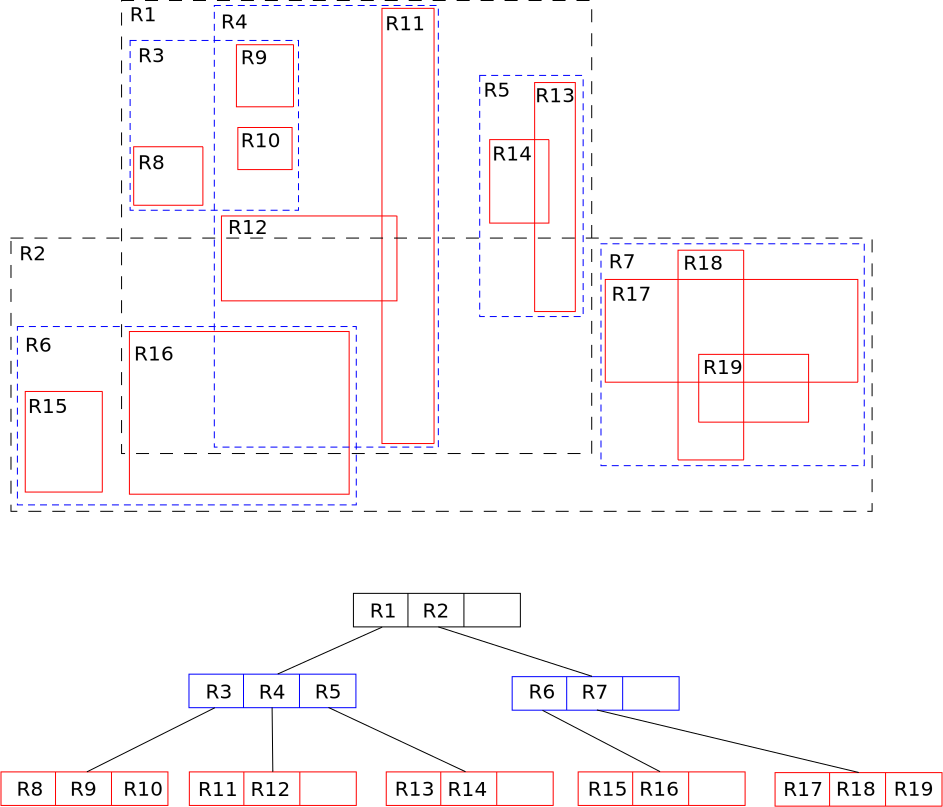

# 자료구조

[MSDN](https://learn.microsoft.com/ko-kr/dotnet/standard/generics/collections)

## 앞서서

### 자료구조 개념

데이터를 용도에 따라 더 효율적으로 **저장, 읽기, 탐색, 삽입&삭제** 하기 위한 데이터 저장 기법.
프로그래머 입장에서는 일반적으로 각 동작에 따라 **평균 [시간 복잡도](#시간-복잡도)**와 **최악 시간 복잡도**를 기준으로 어떤 자료구조를 사용할지 결정하게 된다.

## [List\<T>](https://learn.microsoft.com/ko-kr/dotnet/api/system.collections.generic.list-1?view=net-8.0)

데이터를 연속된 메모리 공간에 저장하는 배열 기반 자료구조이다. 미리 예약된 공간 내에서 길이를 조절 가능한 배열처럼 작동하고, 예약된 공간 이상의 공간이 필요해지면 더 큰 공간을 새로 할당받아 전체를 복사해 이동하는 방식으로 구현되어있다.

* 마지막에 삽입 `Add()` O(1)
* 중간에 삽입 `Insert()` O(n) : 지정한 위치 이후의 데이터를 전부 한 칸씩 밀어서 새로 저장해야 한다.
* 중간에 삭제 `RemoveAt()` O(n) : 삭제한 위치 이후의 데이터를 전부 한 칸씩 당겨서 새로 저장해야 한다.
* 특정 데이터 삭제 `Remove()` O(n) : 특정 데이터 탐색 + 중간에 삭제
* 인덱스 접근 `[ ]` O(1) : 데이터가 연속되서 저장되어 있으므로 인덱스를 알면 곧바로 위치를 계산할 수 있다.
* 탐색 `IndexOf()` `Contains()` O(n) : 데이터 순서에 제약이 없는 자료구조이므로 모든 데이터를 하나씩 순회해서 탐색해야 한다.

## [LinkedList\<T>](https://learn.microsoft.com/ko-kr/dotnet/api/system.collections.generic.linkedlist-1?view=net-8.0)

노드마다 하나의 데이터와 이전 순번, 다음 순번 노드의 위치를 갖고있는 [노드](#노드node) 기반 자료구조이다. 데이터를 앞 뒤 순서에 기반해서 저장하기 때문에 선형적 자료구조이지만, 실제 메모리상에서 데이터를 연속적으로 보관하지 않았기 때문에 삽입 삭제시 재 정렬이 필요없다.

* 삽입 `AddAfter()` `AddBefore()` `AddFirst()` `AddLast()` O(1) : 위치를 이미 알고있다는 조건 아래에서, 앞 뒤 노드의 참조만 변경하므로 복잡도가 상수이다.
* 접근 : 노드간의 링크를 기반으로 한 자료구조이므로 중간의 노드에 접근하기 위해서는 노드를 하나씩 타고 넘어가야 한다. 그래서 인덱스를 통한 접근 자체를 기본적으로 지원하지 않는다.
* 탐색 `Find()` O(n) : List와 마찬가지로 데이터 순서에 제약이 없는 자료구조이므로 모든 데이터를 하나씩 순회해서 탐색해야 한다.

## [Stack\<T>](https://learn.microsoft.com/ko-kr/dotnet/api/system.collections.generic.stack-1?view)

List와 작동 방식이 유사한 배열 기반 자료구조이다. 가장 마지막 위치에서만 데이터를 넣고, 마지막 위치에서만 데이터를 꺼낼 수 있다. 기능을 제한함으로서 최근에 저장한 데이터부터 순차적으로 꺼낸다는 사용 목적을 명확히 한 자료구조.

## [Queue\<T>](https://learn.microsoft.com/ko-kr/dotnet/api/system.collections.generic.queue-1?view)

Stack과 반대로 가장 먼저 넣은 데이터만 꺼낼 수 있는 자료구조. '머리'와 '꼬리'에 헤당하는 인덱스를 데이터를 넣고 꺼낼때마다 움직여주는 방식으로 구현되어있다(C#). 손님 줄은 가만히 서있는데 직원이 움직이면서 앞에서부터 응대하는 그림.

## [Dictionary\<T>](https://learn.microsoft.com/en-us/dotnet/api/system.collections.generic.dictionary-2?view)

Key와 Value의 데이터쌍의 Key를 Hash 함수를 통해 임의의 인덱스값으로 만들어서 배열의 해당 인덱스에 데이터를 저장하는 방식. (`table[Hase(key)]`) 그 작동 방식의 특징상 미리 넓은 배열을 준비할 필요가 있기 때문에 저장 공간을 많이 필요로 하는 대신, 일반적으로 탐색에 Hash 함수의 작동 시간만을 필요로 한다.

### Hash table의 충돌

일반적으로 준비된 배열보다 폭넓은 경우의 수를 갖는 Key를 좁은 인덱스값으로 해싱하다 보면 키 값이 겹칠 수가 있다. 일례로 '고객 전화번호'를 key로 사용하고 '전화번호 뒷자리'를 인덱스로 사용한다면, 전화번호 뒷자리가 같은 사람이 있을 수 있다.

충돌에 대처하기 위해 데이터를 LinkedList로 구성하는 체이닝(Chaining), 미리 정해둔 다른 주소에 저장하는 개방 주소법(Open Addressing) 등을 사용한다. 이 경우 접근시 테이블의 해당 주소에 접근한 뒤 찾는 Key가 맞는지 확인 및 추가적인 순회가 필요하다.

## 그래프(비 선형 자료구조)

그물형 스킬트리나 이동 경로 지도와 같이 일직선만으로는 표현할 수 없는 데이터들의 관계를 표현한 것. 그래프는 그 종류와 구현 방식이 다양하기 때문에 Generic Collection이 존재하지 않는다.

모든 정점이 연결되있으면 연결 그래프, 관계에 수치가 포함되면 가중치 그래프라고 하며 그 관계가 단방향인지(갈 때와 올 때가 다를 수 있음) 양방향(무방향)인지(갈 때와 올 때가 동일)까지 더해서 '단방향 연결 그래프', '양방향 가중치 그래프'와 같이 부를 수 있다.

### 인접 행렬 그래프

그래프 내 각 정점의 관계를 2차원 배열로 구현한 것이다.  
정점 n개의 관계를 자료형 T로 나타낸 배열 `T[,] graph = new T[n, n]`의 원소 `graph[i, j]`는 i에서 j를 향한 관계를 의미한다. 예를 들어 선행 스킬을 bool로, 이동 비용을 int로 표현하는 식이다.  

행렬 방식은 찾고자 하는 관계를 인덱스로 바로 확인 가능해서 접근이 빠르지만, 메모리 사용량이 정점 개수 n에 대해 n<sup>2</sup>으로 많다.

### 인접 리스트 그래프

그래프 내 각 정점의 관계를 리스트의 배열로 구현한 것이다.  
정점 n개의 연결 관계를 나타낸다면 `List<int>[] graph = new List<int>[n]`과 같은 형태가 될 것이다. 배열의 원소인 각각의 리스트`graph[i]`는 정점을 의미하고, 리스트에 데이터`graph[i].Contains(j)`가 true라면 정점 i에서 j로 연결되어 있다는 것을 의미한다. 가중치 그래프라면 int 대신 Tuple을 사용한 그래프 등을 사용할 필요가 있다.

리스트 방식은 메모리 사용량을 관계의 개수 만큼으로 줄일 수 있지만, 관계를 확인하는데 리스트의 순회가 필요하다.

*****

## 추가

### R 트리

2차원 이상의 영역에 놓인 데이터를 거리가 가까운 데이터끼리 같은 노드의 아래에 속할 수 있도록 구성한 트리 자료구조이다.

  
By Skinkie, w:en:Radim Baca - Own work, Public Domain, <https://commons.wikimedia.org/w/index.php?curid=9938400>

게임의 물체들은 논타겟 적중 판정 등 위치를 기반해 물체를 탐색해야할 상황이 자주 발생하고, 이럴 때 마다 모든 물체를 순회해서 위치를 확인하는 것은 매우 비효율적이다. 따라서 위 그림과 같이 위치를 기반으로 어느 영역에 속하는지를 기준으로 트리를 나눠서 판정하고자 하는 영역과 겹치지 않는 노드는 아예 배제할 수 있는것이 R트리의 특징이다.

```pseudo code
Search(RtreeNode node, Rect targetArea)
{
    // result는 중복을 불허하거나 더할때 제거해야 한다
    Collection result;
    if(node.isLeaf)
    {
        foreach(Node child in node)
        {
            if(IsOverlapped(child.area, targetArea))
                result.Add(Search(child, targetArea));
        }
    }
    else
    {
        foreach(Element item in node)
        {
            if(IsOverlapped(item.position, targetArea))
                result.Add(item);
        }
    }
    return result;
}
```

(적중 대상을 찾는 경우를 가정)

각 노드들은 자신의 범위, 부모 노드의 정보, 보유하고 있는 데이터(또는 자식 노드)로 구성되어 있다. 또한 가질 수 있는 데이터의 최소~최대 개수에 제한이 있어 데이터의 수가 변화할 때에는 노드가 나눠지거나 다른 작은 노드와 합쳐지기도 한다. 만약 데이터가 추가될 때에 해당 위치를 포함하는 노드가 없다면 가장 가까운 노드가 확장될 것이다.

기본적으로는 B 트리의 좌표 데이터 버전이지만, 2차원 이상으로 넘어온 특징상 한 데이터가 여러 노드에 속하는 경우도 생기고 그에 따른 처리도 필요해진 모습이다.

## 기타

### 시간 복잡도

데이터의 개수(n)가 증가함에 따라 읽기, 탐색, 삽입&삭제 각각에 필요한 시간이 어떻게 변화하는지 나타낸 것. Big-O표기법을  사용한다.

* O(1)
* O(log n)
* O(n)
* O(n<sup>2</sup>)

### 노드(node)

자료를 관리하는 방법 중 하나이다. 노드마다 데이터와 다른 노드의 위치를 갖고있고, 노드간의 연결 관계를 설정해서 자료구조를 구성한다.
